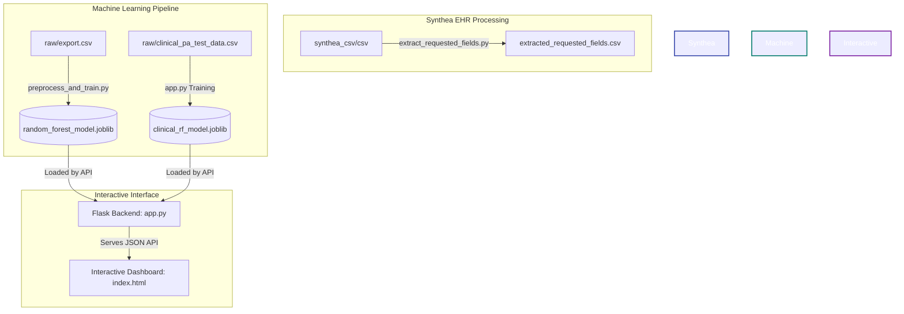

# Prior Authorization Decision Platform & ML Pipeline

A machine learning-driven platform for predicting healthcare **Prior Authorization (PA)** decisions. This repository contains data processing tools for Synthea EHR datasets, an ML training and inference pipeline utilizing Random Forest classifiers, and a premium Flask-based interactive web dashboard.

---

## 🛠️ System Architecture & Workflow

Below is the workflow of the platform, showing how raw clinical data and export records are transformed, trained, and served through the interactive dashboard:



---

## 📂 Repository Structure

The project is organized into two primary layers: root data extraction scripts and the ML/web application dashboard pipeline inside the `organized_scene` directory.

| Path | Description |
| :--- | :--- |
| 📁 `scripts/` | Script for extracting structured clinical fields from raw EHR files. |
|    └── `extract_requested_fields.py` | Joins patient, encounter, condition, and medication CSVs into a standardized format. |
| 📁 `synthea_csv/csv/` | Directory where raw Synthea CSV files should be placed (e.g., `patients.csv`, `encounters.csv`). |
| 📄 `extracted_requested_fields.csv` | Standardized clinical CSV extracted from raw Synthea EHR files. |
| 📁 `organized_scene/` | Core ML pipeline and Flask Web Application. |
|    ├── 📁 `scripts/` | Pipeline executables (preprocess, train, score, compare, interactive terminal prompt, Flask app). |
|    ├── 📁 `static/` | Web frontend assets (HTML, CSS, JS) for the dashboard. |
|    ├── 📁 `raw/` | Input datasets: `export.csv` (aggregate rates) and `clinical_pa_test_data.csv` (clinical level). |
|    ├── 📁 `processed/` | Output directory containing cleaned features ready for modeling. |
|    ├── 📁 `models/` | Trained Random Forest pipelines serialized as `.joblib` files, plus metrics. |
|    └── 📁 `predictions/` | Saved predictions and evaluation CSVs. |
| 📄 `requirements.txt` | Python dependencies. |

---

## 🚦 Getting Started

### 1. Clone the Repository
Clone the repository and navigate into the workspace root directory:
```bash
git clone https://github.com/Tamil9080/Prior-Authorization.git
cd Prior-Authorization
```

### 2. Prerequisites & Installation
Ensure you have **Python 3.10+** installed. Then install the project dependencies:
```bash
pip install -r requirements.txt
```

### 3. Running the Dashboard Portal
Start the Flask application from the root directory:
```bash
python organized_scene/scripts/app.py
```
> [!NOTE]
> **First Run Model Training**: Because the serialized `.joblib` model binaries exceed GitHub's file size limit, they are ignored under `.gitignore`. On the first startup, the Flask backend will automatically preprocess the raw clinical datasets and train both the Clinical and Review Random Forest classifiers. This takes **less than 3 seconds** to complete, after which the portal is fully operational at [http://127.0.0.1:5000](http://127.0.0.1:5000).

---

## 💾 Part 1: EHR Clinical Data Extraction

Before running machine learning pipelines, you can extract prior-authorization fields from a raw Synthea dataset.

1. Place your raw Synthea CSV files (like `patients.csv`, `encounters.csv`, `procedures.csv`, etc.) in the `synthea_csv/csv/` directory.
2. Run the extraction script:

```powershell
python scripts/extract_requested_fields.py
```

This merges patient demographics, diagnoses, procedures, medications, encounter details, provider specialties, and lab results into a single file: `extracted_requested_fields.csv`.

---

## 🤖 Part 2: Machine Learning Pipelines

The platform operates on two distinct models:

### A. Aggregate Rate Model (Aggregate Levels)
Trained on aggregate prior-authorization requests (`export.csv`).
* **Features**: Carrier, Service Category, Request, Code Type, Code, Description of Service, response times, request counts, etc.
* **Target**: `decision` (approved vs. denied), derived by thresholding the aggregate `Approval rate` at 50%.

### B. Clinical Decision Model (Patient Levels)
Trained on patient-level prior authorization records (`clinical_pa_test_data.csv`).
* **Features**: Patient age, diagnosis text, ICD-10 code, requested service/drug, procedure code, clinical history, medications, lab results, provider specialty, and urgency.
* **Target**: `decision_reason` (e.g. Clinical criteria met, clinical criteria not met, cannot render decision).

### CLI Script Executables

All ML pipeline operations can be run from the workspace root directory:

#### 1. Preprocess Data and Train (Aggregate Model)
Preprocesses the aggregate data, splits it into train/test (80/20), trains a Random Forest Classifier, and saves the metrics/model.
```powershell
python organized_scene/scripts/preprocess_and_train.py
```

#### 2. Score a New CSV File or Single JSON
Scores a test CSV or JSON file using the trained aggregate model:
```powershell
python organized_scene/scripts/predict_decision.py path/to/input.csv --output organized_scene/predictions/predicted_decisions.csv
```

#### 3. Run Train & Score in One Command
```powershell
python organized_scene/scripts/run_pipeline.py path/to/input.csv --output organized_scene/predictions/pipeline_predictions.csv
```

#### 4. Compare Predictions Against Ground Truth Labels
To evaluate performance and compare predictions against the actual outcomes (with decision/approval rate removed from features):
```powershell
python organized_scene/scripts/compare_with_original.py organized_scene/raw/export.csv --output organized_scene/predictions/comparison.csv
```

#### 5. Interactive Terminal Predictor
Type clinical values directly into your console to get real-time decisions and probabilities:
```powershell
python organized_scene/scripts/predict_interactive.py
```

---

## 🌐 Part 3: Interactive Flask Dashboard

We provide a beautiful, dark-themed responsive dashboard for checking prior authorizations interactively.

### Launching the Server
Run the Flask server from the root of the project:

```powershell
python organized_scene/scripts/app.py
```

* The server starts on **`http://127.0.0.1:5000`**.
* Open this URL in your web browser.

### Features
* **Two Interactive Modes**: Switch between predicting patient-level clinical decisions and carrier-level aggregate rates.
* **Preset Loaders**: Load pre-configured sample cases (e.g., Rheumatoid Arthritis, ADHD step-therapy failure, Osteoarthritis) with a single click.
* **Probability Visualizer**: Renders beautiful progress bars showing the class probabilities (confidence) for each prediction result.
* **Deterministic Resolution**: Maps clinical models' classification outputs directly to final status resolutions (`Approved`, `Denied`, `In Review`, or `Pending Additional Information`).
